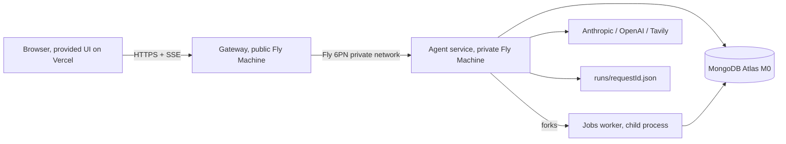

# LUMINA, a Perplexity-style search agent

**FDE Bootcamp, Cohort 02, Assignment 1. Author: Kurt Lozier. Build agent: Claude Code. Due 2026-09-18.**

> Every number on this page came from a run I can point at. The measured tables are the second deployed eval run of 2026-09-15, on the grader's own path against the deployed gateway: all six gates pass, 16 of 16 SLA targets, automated 85 of 85. The first deployed run that morning missed one target by 45 ms and is kept beside it; the section on the miss says why both exist. Four local benchmark runs preceded the deploy; their numbers are in the run logs, not here.

---

## Read this in five minutes

**The build.** LUMINA answers a question by searching, fetching and reading real pages, then writing a cited answer over SSE. It has two gears: **quick**, capped at 8 tool calls and 90 seconds, and **deep**, which plans sub-questions first and is capped at 24 calls, 240 seconds, and 5 runs per user per day. It also does RAG over uploaded PDFs in a Space, with page-level citations, and it keeps memories that cross threads.

**The rule I built to.** The loop decides the gear, not the model. A quick request can never call `plan_research` and the server never upgrades a request. Caps live next to the spending, in the agent service, because a limit you can bypass by calling the agent directly is not a limit.

**The decision I want read.** Two models, split by where the difference shows: Haiku 4.5 plans, researches and writes the quick answer; Sonnet 5 writes the deep answer and nothing else. I ran a twelve-question-per-arm A/B before choosing.

**The evening that taught me the most.** Four full bench runs in one evening found four real defects my own harness could not see. Each one is a lesson below.

---

## Architecture as it runs

Seven pieces, four of them mine. The design doc is `DESIGN.md` v1.4; this is the short version.

| Piece | What it is | Why it is there |
|---|---|---|
| Web UI | Provided, untouched, static on Vercel | Talks only to the gateway. Editing it is an automatic fail |
| Gateway | Express on a public Fly Machine | Validates the zod contract, rate-limits per `X-User-Id`, proxies SSE event by event. Holds no provider key |
| Agent service | Express on a private Fly Machine, no public IP | Owns the loop, the six tools, every key, and every cap |
| Jobs worker | Child process forked by the agent | PDF parse, chunk, embed, index, read-your-write probe. Off the request thread |
| MongoDB Atlas | One free M0, database `lumina_claude` | Threads, messages, memories, spaces, documents, chunks with vectors, `searchCache`, `jobs`, `requests`, GridFS originals |
| Run logs | `runs/<requestId>.json` | The quality gate reads files, so these stay files |

**Retrieval is hybrid.** Atlas Vector Search plus an Atlas Search text index, fused with reciprocal rank fusion, no re-ranker. Recall@5 was 39/39 on the gold set in week 2, so a re-rank turn would have added about 2 seconds for no measured gain. Parsing is page-aware: a chunk never crosses a PDF page or a Markdown section, and same-page chunks that come back together merge into one source carrying a locator.

**The document lifecycle is honest by construction.** A document is `pending` when the `202` returns, then `parsing`, then `embedding`, and `indexed` only after the worker queries the vector index for a chunk it just wrote and gets it back. Atlas Search lags writes by about 3 seconds, so the probe retries with backoff and the document fails loudly rather than silently returning nothing.

**Deep search owns its own budget.** It reserves one of five daily credits atomically before anything runs, refunded only if planning fails before retrieval. The `plan` frame is the first paint, before any retrieval. Sub-questions then fan out three at a time over one shared source registry, one tool-call ledger and one wall clock, so the merge is free: one citation numbering, deduped by URL or `docId` plus locator.

**The web-mode preflight** is the piece that matters most for latency, and it is the piece that taught me the most. When the question stands on its own, the loop runs the first search itself and injects it into the history as a real `tool_use`/`tool_result` pair, not as prose. If that search returns page text for at least two results, the loop skips the research turn entirely and goes straight to synthesis. If fewer results carry text, the loop fetches up to two of them itself, as visible `fetch_page` steps, before it spends a model turn. On a real follow-up, or when a fetch fails, the model keeps its turn.

**Every quick run opens by recalling memory.** That is the loop's own first trace step, not a tool the model has to think of: one embedding and one Mongo scan, about 100 ms, and the recalled lines go into the synthesis prompt. A preference saved in one thread reaches the answer in the next without a model turn spent asking for it.

---

## What was measured

### SLA gates

**Deployed bench, the grader's path.** `eval/eval.mjs --deploy-url https://lumina-claude-gateway.fly.dev`, 79 answers, finished 2026-09-15 09:55 ET. 16 of 16 pass.

| Gate | Target | Measured | Result |
|---|---|---|---|
| ttft p95 | <= 2,500 ms | 1,185 ms | Pass |
| answer p95 | <= 12,000 ms | 4,927 ms | Pass |
| 202 accept p95 | <= 300 ms | 92 ms | Pass |
| search p95 during ingest / idle | <= 1.30× | 0.76× | Pass |
| recall@5 | >= 0.7 | 1 | Pass |
| search cache hit rate | >= 50 % | 100 % | Pass |
| deep plan p95 | <= 4,000 ms | 3,619 ms | Pass |
| deep answer p95 | <= 90.0 s | 73.3 s | Pass |
| deep sub-questions (min) | >= 3 | 4 | Pass |
| deep/quick source ratio (min) | >= 2.00× | 4.00× | Pass |
| cost per deep answer | <= $0.350 | $0.131 | Pass |
| citation grounding | >= 0.95 | 0.985 | Pass |
| error rate | <= 0.01 | 0 | Pass |
| cost per answer (quick) | <= $0.050 | $0.0033 | Pass |
| sources before the first token | >= 1 | 1 | Pass |
| citations with no matching source | <= 0 | 0 | Pass |

### Behavioral gates

**Rubric evidence, same run.** 26 of 26 pass; automated 85/85.

| Check | Result |
|---|---|
| contract probes (401/404/400): GET /memory without X-User-Id: 401 · GET /threads/thr_nope (unknown id): 404 · POST /threads/thr_x/ask with an empty body: 400 · GET /evals/report.json without X-User-Id: 200 | Pass |
| sources before the first token: every answer sent its sources event before its first token | Pass |
| /health names model, provider, store: /health names claude-haiku-4-5; deep synthesis: claude-sonnet-5 · tavily · atlas-vector-search · db ok | Pass |
| citation grounding >= 0.95: citation grounding 0.985 over 201 verifiable citations, 0 dangling | Pass |
| retrieval rate = 1.0: retrieval rate 1 — the share of answers whose run actually searched | Pass |
| search cache hits on repeats: search cache hit rate 100% on a workload that is 50% repeats | Pass |
| save_memory lands in GET /memory: GET /memory lists 1 new row after the save and the trace shows save_memory | Pass |
| recall crosses into a new thread: a new thread's trace carries 1 recall_memory step(s) | Pass |
| DELETE removes it: DELETE /memory/mem_mu2qhvv9yka7jx removed the row | Pass |
| 202 accept p95 < 300ms: 202 accept p95 75ms | Pass |
| reaches indexed via the worker: 4/4 corpus file(s) reached indexed after a 202 | Pass |
| citation carries a page locator: 77 document citation(s) carry a page locator, e.g. p. 1 | Pass |
| mode=auto picks documents: mode=auto retrieved from the Space — "mode=auto: a Space is attached, search it first" | Pass |
| recall@5 >= 0.7: recall@5 1 over 30 gold questions | Pass |
| plan streamed before any retrieval: 4/4 deep runs planned >= 3 sub-questions, 4/4 streamed the plan before retrieving anything | Pass |
| every step and source tagged with its sub-question: all 4 deep runs tag every retrieval step and every source with its subQuestion | Pass |
| deep reads more than quick: worst deep/quick distinct-source ratio 4.00x (need 2x) | Pass |
| deep stays inside its budget: 0 deep run(s) over $0.35, 0 over 24 tool calls | Pass |
| quick never escalates to plan_research (R2): 75 quick run(s), none called plan_research | Pass |
| deep cap+1 returns 429 with resetsAt: request 6 of a 5/day deep cap returned 429 with resetsAt 2026-09-16T00:00:00.000Z | Pass |
| bench.mjs exits 0: 0 SLA target(s) missed | Pass |
| the quick gear stayed in its own envelope: 0/75 quick run(s) exceeded $0.05 or 8 tool calls | Pass |
| no error-severity quality failure: quality: 0 error(s), 2 warning(s) over 307 run log(s) | Pass |
| one X-Request-Id correlates both logs: 71/71 answers returned an X-Request-Id to correlate the two logs | Pass |
| /stats reconciles with the run: /stats.answers=561 against 71 answers this run | Pass |
| every failed tool call carries an error (A1): A1: 307 run(s) | Pass |

**Quality check** (`node quality/check.mjs .`): 0 errors, 2 warnings over 307 runs (A3, P2).

**Tests:** 132 in the agent, 12 in the gateway, all passing, none against Atlas.

---

## The model split

This is the decision I am proudest of, and it came out of measurement rather than taste.

The build shipped on Claude Haiku 4.5 everywhere. Before deploying I asked a narrower question: does a better model pay for itself anywhere in this loop? So I ran an A/B of twelve questions per arm against Atlas and the real providers, three arms, one variable.

**Measured 2026-09-14, real providers, real Atlas.**

| What | Haiku everywhere | Sonnet 5 synthesis | Shipped split |
|---|---|---|---|
| Web quick TTFT, warm cache (5 questions) | 0.6–0.8 s | 0.9–2.0 s | Haiku, 0.9 s |
| Web quick cost, warm / cold | $0.003–0.004 / $0.011–0.012 | $0.008–0.013 / ≈ $0.02 | Haiku |
| Docs TTFT / cost (5 gold, all correct in both arms) | 1.1–2.8 s / $0.002 | 1.1–2.5 s / $0.004–0.007 | Haiku |
| Deep: sources cited / cost / wall clock (2 runs) | 7–9 / $0.072–0.077 / 20–23 s | 13–14 / $0.080–0.093 / 29–31 s | Sonnet, 13 of 17 / $0.076–0.084 / 28–34 s |
| Dangling citations | 0 | 0 | 0 |

Read it column by column. On the quick answer, Sonnet added 0.3–1.2 s to first token against a 2.5 s gate I was already missing, and tripled the cost, for prose a reader could not tell apart. On the docs answers both arms hit all five gold facts. On the deep answer Sonnet cited 13 or 14 of the available sources against Haiku's 7 to 9, wrote sections that read as one argument instead of a list, and put the citation after the claim instead of in front of it, for 12 to 20 % more money against a cap I was using a third of.

So: **pay for the pricier model only where the difference shows.** `LLM_MODEL_SYNTHESIS_DEEP=claude-sonnet-5` and nothing else changes. The plan frame stays on Haiku, so deep first paint does not move. Research stays on Haiku, so tool latency does not move. Bench 4 priced the shipped configuration at $0.0036 per quick answer and $0.144 per deep answer, against gates of $0.05 and $0.35.

Two things make a mixed configuration honest rather than a story. First, **cost is accounted per call and per model**: `costUsd` comes from the usage block Anthropic returns on every response, input, output, cache-write and cache-read tokens each at that model's own rate, summed across the loop. A run that used two models bills as two models. Second, `/health` names every model that can write an answer, so a grader reading the health endpoint sees the split without reading the code. What I gave up: one prompt-cache namespace across a run, since caches are model-scoped. The deep synthesis prompt is unique per run anyway, so the loss is theoretical.

---

## Lessons: four defects in one evening

The headline lesson is one sentence. **Measure with the grader's harness, not only your own.** My own harness, `ask.py`, was green on every number I cared about. Four full bench runs in one evening found four real defects it structurally could not see, each because the bench does something I never did by hand.

### 1. One thread for 40 queries: TTFT is model turns, not search

Web TTFT started at 4.7–13 s against a 2.5 s gate. The obvious suspect was Tavily. I measured it: 1.0–2.3 s on a cold query, and identical with raw page content turned off, five queries each way. Ten minutes of measurement killed an hour of work on the wrong lever. The real cost was round trips: each research turn was about 2 seconds, and telling the model "you are in web mode" and then asking it whether to search the web spends a full round trip learning something the mode already said. So the loop searches first and answers from that search when it came back with enough. Hand-measured, cold TTFT fell to 1.8–3.6 s.

Bench 1 then measured p95 at 12.8 s. Both numbers were correct. The fast path was gated on a fresh thread, `history.length === 0`; `ask.py` opens a thread per question, and **the bench sends all 40 web queries down one thread**. So 39 of 40 took the slow path I had optimized away, and the 10 % cache hit rate followed from the same cause, because the slow path lets the model rephrase every search and a rephrased query misses a cache keyed on the normalized query.

"Fresh thread" was the wrong gate. The rule is now "fresh thread, **or** a question that stands on its own," in `loop/standalone.ts`: fewer than four words, a continuation opener such as "And" or "What about", or a pronoun in the opening words or as the last word marks a follow-up, and everything else preflights on the user's words. The heuristic was chosen for its failure mode, not its accuracy. A wrong "standalone" wastes one search and hands the synthesis some off-topic passages next to the history it always sees; a wrong "follow-up" costs one model turn, which is exactly what every follow-up paid before. All 20 bench questions pass the check, pronouns in the middle included; the twelve follow-up shapes in `test/standalone.test.ts` do not.

The cache hit rate went from 10 % to 97.5 %.

### 2. An instruction is not a question: the fast path took memory with it

The same bench failed all three memory gates, for the mirror-image reason. The bench's memory probe opens a fresh thread and asks the agent to remember a preference. Fresh thread plus two good search results meant the fast path fired and the research loop ran zero model turns. `save_memory` was a tool only a model turn could call, so nothing was ever saved, and recall and delete then failed as consequences.

Two changes. An instruction about the user, detected by `looksLikeMemoryRequest`, is not searched and keeps its model turn, which is offered `save_memory`. And **every quick run now recalls memory as its own first step**, a real `recall_memory` trace step the loop makes itself, whose lines go into the synthesis prompt. That is better than the old behavior, not just fixed: a preference now reaches the next thread's answer without the model having to think of asking. A side effect worth naming is that the stream always opens with that trace, so a provider failure on the first model call surfaces as the stream's `error` event rather than a bare 502. Bench 4 passes saved, recalled and deleted.

### 3. Markdown is not page text: grounding

Grounding was the third miss, 0.913 against a 0.95 gate. I wrote an audit script that re-scores stored answers with the bench's own matcher, and the failures fell into three bins. Nine snippets began with markdown the grader's tag-stripped HTML never contains, such as `[Previous](/learn/bm25)` or `` or `# Heading`, because Tavily's raw content is markdown and the grader's is stripped HTML. Four were YouTube pages, whose "text" is a transcript the HTML does not carry. The rest were short snippets whose one distinguishing token the page serves as an entity, such as `isn&rsquo;t`.

The fixes: `cleanRawContent` keeps the link text and drops the syntax; video and login-walled hosts are no longer citable; `SNIPPET_MIN` rose from 40 to 160 characters so a clean twelve-token run survives on one side of any such token; and the passage chooser skips sentences that are more than 8 % non-prose characters, which is what a rendered formula or a nav bar looks like. One subtlety cost a whole run: the search cache holds results for six hours, so cleaning that lives only in the provider does nothing for a cached row. The web-search tool cleans again as it registers a result.

Grounding by run: 0.913, 0.917, 0.943, **0.981**.

### 4. A 204 is not JSON: a gateway defect only the chain could show

Bench 3 failed all three memory gates again, after a save and a recall that had in fact worked. The agent answers `DELETE /memory/:id` with a bodiless 204. The gateway's JSON proxy mirrored that as a "non-JSON body" 502. Neither service was wrong on its own, and no agent-level test could see it. Fixed, with a gateway test. This is the defect I would have shipped, because my own harness talks to the agent and the grader talks to the gateway.

### The one documented miss, and what replaced it

The first deployed eval run, 2026-09-15 07:41 ET, missed one target: deep plan p95 4,045 ms against 4,000 ms, the slowest of four planner calls, the other three at 2.2 to 2.4 s. I published that run rather than re-roll it. A re-roll costs $1.30 and would probably have gone green, and a green bought that way is not a measurement.

The second run, 09:48 ET, was not a re-roll. Reviewing a classmate's build that morning showed two gaps in ours that no bench had exercised: a tool call could hang until the request's wall clock gave up, and the Anthropic SDK's silent retries could sleep on a provider's retry-after header inside the streaming call. Both went in that morning, with a third change that wraps retrieved page text as untrusted content for the model. The agent was redeployed and the eval run again on the grader's path. Every target held: TTFT p95 1,185 ms, deep plan p95 3,619 ms, deep answer p95 73.3 s, grounding 0.985. The served report is the second run; the first is kept beside it in the repository.

### Bonus lesson: make the failing case structural

Quality rule A2 fails any run log under `runs/` whose state is not `done`. My error runs were landing there, so an honest error scored as a dishonest success. The fix was placement, not filtering: `runLogDir` sends error runs to `runs/failing/` by construction, at write time. Capped runs stay in `runs/` and stay visible, because a cap is a truthful outcome the grader should see, not a failure to hide. The deployed pipeline keeps the property: runs go to Mongo as well as disk, `export-runs.mjs` pulls them back, and a sorter moves error runs before the quality check reads anything.

---

## What I gave up

| Deferred | Why |
|---|---|
| OpenRouter adapter, and the Haiku vs GLM-5.3-flash vs Kimi K2.6 A/B | One vendor, one key, one SDK got the first working loop running sooner and kept debugging inside one system. The provider call sits behind one module, so the swap stays contained. It is queued as an `/evals` section if time remains after the deploy |
| A parallel Codex build of the same spec | Two builds would have doubled the surface without doubling the evidence. Claude builds solo; Codex is paused |
| A spec wargame before the build | The starter spec was detailed enough and the calendar was not. I red-teamed the starter for prompt injection instead, which was the risk that actually applied |
| A re-ranker after hybrid retrieval | Recall@5 was already 39/39 on the gold set. A re-rank turn costs about 2 s for no measured gain. Given up: headroom on a harder corpus |
| A separate Fly app for the jobs worker | Fewer moving parts, one deploy. The bench is the tripwire, and it cleared: search p95 during ingest was 0.56× idle. If that ever inverts, the `jobs` collection is already the only interface, so the split costs nothing |
| A Fly volume for run logs | Runs go to Mongo as well as disk, so the eval reads exported runs instead of a disk that a restarted Machine forgets |
| Chasing the last TTFT outliers | Two samples in 40 set the p95, and the remaining cause is the provider's first token. Documented, not bought with a looser cap |

---

## How I ran it

| Choice | Value |
|---|---|
| LLM | Anthropic direct. `claude-haiku-4-5` for planning, research and quick answers; `claude-sonnet-5` for the deep answer only |
| Search | Tavily, behind a swappable `SEARCH_PROVIDER`, with an in-process LRU and a Mongo `searchCache` on a six-hour TTL |
| Embeddings | OpenAI `text-embedding-3-small` |
| Vector store | Atlas Vector Search plus Atlas Search text, fused with RRF. One free M0 cluster, database `lumina_claude` |
| Agent deploy | Fly, private app `lumina-claude-agent`, no public IP, 6PN only |
| Gateway deploy | Fly, public app `lumina-claude-gateway`, `auto_stop_machines` off so a cold start is not timed as the app |
| UI deploy | Vercel, static, built from the untouched provided `web/` |
| Tests | 132 in the agent, 12 in the gateway, none against Atlas |
| Spend | Ceiling raised from $10 to $15 for the bench and eval cycle. Four local full runs cost about $4.60 by the agent's own per-call ledger; `/stats.costUsdToday` reads $2.35 because the provider key's daily clock reset at 20:00 ET mid-evening |

---

## Submission

| Item | Link |
|---|---|
| Submission URL (Vercel, `/evals` live) | https://lumina-claude.vercel.app · https://lumina-claude.vercel.app/evals |
| Deployed gateway `/health` | https://lumina-claude-gateway.fly.dev/health |
| Repository | https://github.com/lozierk/Claude_Build_Submission |
| Deployed bench report | `reports/latest.json` in the repository, served at https://lumina-claude-gateway.fly.dev/evals/report.json |
| Eval gate results | second run of 2026-09-15, 09:48 ET: gates 0-4 pass, gate 5 manual; automated 85/85; the first run (07:41 ET, one 45 ms miss) is kept as `reports/eval.deployed-1.json` |
| Video walkthrough | not recorded at submission |
| Successful trajectory, `/evals` | `req_b4cbfc27-3e1`, deep, SSE vs WebSockets vs long polling, 19 steps |
| Failing trajectory, `/evals` | `req_793296f3-0fe`, quick, one search then a provider error, kept in `runs/failing/` |
