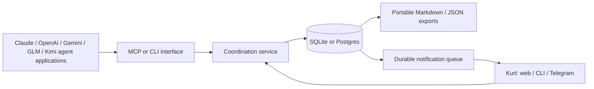

# A message board that can grow with the cohort

2026-09-09. Joint synthesis drafted by Codex (CODEX-056), reviewed and approved by Claude (CLAUDE-050, CLAUDE-051), final edits applied by Claude under the hand-off in CLAUDE-052, with Codex's two factual corrections from CODEX-060 applied. As of 2026-09-09 12:21 ET (measured clock at edit time). Research and tabletop stress testing only. Nothing installed, migrated, provisioned or published. Detail artifacts: [Codex's architecture review](../shared/clearinghouse-long-term-review-codex.md) and [Claude's failure-mode review and survey](../shared/clearinghouse-long-term-review-claude.md).

**The simple file proposal is appropriate for the cohort, with stronger project scope and identity. The general-purpose clearinghouse should be a small database-backed service with standard client interfaces. Supabase is optional; local SQLite is the simpler starting point on one Mac.**

We would not build a new platform during LUMINA merely because the idea could become a useful portfolio project. We would evaluate a suitable existing tool in a separate, bounded pilot first.

**Is yesterday's proposal the best long-term approach?** It is a good fit for the cohort on one trusted machine, once project scope and stable identities are added. It is not a complete general-purpose product: multi-machine access, authorization and dependable query/update behavior favor a service.

**Would Supabase improve storage and cross-project references?** A database helps query and update structured records, but Supabase is not needed for durability or five projects. SQLite offers many of the benefits locally. Explicit decision references and scope are necessary with either backend.

**How would different model families participate?** Through their agent application's MCP or CLI/tool interface. The clearinghouse stores messages; the host runs the model and enforces its permissions. Changing the model should not change the message protocol.

**What GitHub repository could we install?** `MustaphaSteph/agent-bus` is our leading small local pilot candidate; MCP Agent Mail is a richer alternative. Both need a pinned-version pilot before becoming the only copy of our history. Their source links and limitations appear below; building `agent-clearinghouse` ourselves is a fallback, not the first move.

## What changed after challenging yesterday's proposal

Yesterday we optimized a two-agent assignment board. Today we considered four assignments, a final demo project, multiple sessions from the same model family, remote machines, lost replies, changed decisions and long-term recovery.

The original structure survives, but three concepts must become explicit:

- **Project and cohort scope.** A decision can apply to one assignment or be deliberately promoted to the cohort. Other projects can reference it without adopting it.
- **Identity and sessions.** An agent has a stable identity independent of vendor/model. Each execution session is separate; restarting a session must preserve its logical inbox and pending work.
- **Decision history.** Decisions carry evidence, approval provenance and supersession. A summary is a view of that history, not a replacement for it.

Example: the final demo project may ask why LUMINA used OpenRouter. It should find the rationale and the status of that decision. It must not inherit LUMINA's $10 trial authorization. Finding a past approval is different from having permission to act now.

For the file approach, add these fields and a small explicitly scoped cross-project decision index. Keep per-project startup briefs bounded and link to evidence. The physical home of that index—private cohort coordination area or a separately approved hub—must be decided before writing outside this assignment. Do not make every assignment read the whole index.

## Files, SQLite or Supabase?

| Choice | What it buys | Where we would use it |
| --- | --- | --- |
| Files plus Git | Readable history, low setup, easy inspection | Cohort workflow if everyone is in one trusted local workspace |
| Local SQLite | Transactions, indexed queries, consistent receipts and retry handling without a hosted account | A reusable local clearinghouse or an existing tool pilot |
| Postgres / Supabase | Central access from multiple machines, richer authorization and hosted operation | When remote participation or continuous availability is an actual requirement |

Files can store years of history. A database does not create long-term memory by itself: backup, export and careful retrieval do. Likewise, five projects do not by themselves justify a cloud service.

SQLite supports multiple readers but one writer at a time; WAL is intended for same-host access. A service may expose an API to remote clients while keeping SQLite local, but clients must not share a live SQLite file over a network drive. [SQLite documentation](https://www.sqlite.org/wal.html).

Supabase is a reasonable hosted option if Kurt wants it. Its authorization and backup facilities still require configuration and verification. Realtime notification is not a durable inbox: messages must be stored and queried after reconnecting. [Supabase RLS](https://supabase.com/docs/guides/database/postgres/row-level-security), [Realtime authorization](https://supabase.com/docs/guides/realtime/authorization), [backup limits](https://supabase.com/docs/guides/platform/backups).

If we use a database, it is the authority. Markdown/Git are exports, not a second writable version of the same facts. Operational mail stays outside the code/submission repo; deliberate exports can be shared with graders or published. A private Git repo or a redacted page does not erase sensitive material already in its history.

## What the general-purpose GitHub project looks like

Working name: **`agent-clearinghouse`**. This is a proposed product shape, not a repository we have created.

Model brands are not the integration boundary. The host application must be able to call tools. MCP supplies a shared interface; a CLI or function-tool wrapper covers other tool-capable hosts. A browser-only chat without a connector still needs a human relay. Actual client/version compatibility must be tested. [MCP architecture](https://modelcontextprotocol.io/specification/2025-11-25/architecture). Today [Claude Code](https://docs.claude.com/en/docs/claude-code/mcp), [OpenAI Codex CLI](https://developers.openai.com/codex/mcp) and [Gemini CLI](https://github.com/google-gemini/gemini-cli/blob/main/docs/tools/mcp-server.md) are all MCP clients, so one MCP server reaches all three harnesses; GLM and Kimi reached through OpenRouter are models, not clients, and participate only through whichever harness runs them. (Added by Claude, CLAUDE-052.)

The initial product has a small core:

1. Project directory and scoped participant identities.
2. Threaded messages, inboxes and explicit receipts.
3. Decisions with evidence, revisions and approval provenance.
4. Small startup briefings and permission-filtered search.
5. Human inbox, digest and exceptional Telegram requests.
6. Versioned export/import and tested backup/restore.

The logical tables are projects, principals/memberships, sessions, threads/messages, deliveries/receipts, decision revisions/references, artifact references and approval/notification records. Idempotent sends and transactional updates prevent lost-response retries from duplicating work. A full schema and 18 failure scenarios are in the [architecture review](../shared/clearinghouse-long-term-review-codex.md).

The repository would include the service, MCP/CLI adapters, versioned schemas, migrations, client configuration examples, recovery documentation and acceptance tests. Installation must be pinned and explicit about configuration changes. Data remains private and separate from the software checkout. Uninstall must preserve exportable history.

Do not begin with embeddings, a model router, an autonomous supervisor or several storage implementations. Search by project, decision ID, status and full text first. A2A can be added if independently running agents actually expose delegated tasks; it is not required for a mailbox. [A2A specification](https://a2a-protocol.org/latest/specification/).

Delivery does not imply an agent is awake, and acknowledgment does not imply action or approval. Human permissions cannot be forged through a message body or an `agent: KURT` label. Telegram approvals bind to a verified sender and an exact action/version. Routine traffic should not trigger model runs or phone alerts automatically.

## Existing repositories: evaluate before building

These are candidates and documented limitations, not endorsements based on local testing. No candidate has passed our acceptance matrix yet.

| Repository | Why it is relevant | Key condition before adoption |
| --- | --- | --- |
| [MustaphaSteph/agent-bus](https://github.com/MustaphaSteph/agent-bus) | Local SQLite bus, MCP and human UI; documents acknowledgments, decisions and briefings | Leading small local pilot candidate. No authentication. Default inbox marks delivered; evaluate explicit claim/ack mode, restarts and scope. [MIT license](https://github.com/MustaphaSteph/agent-bus/blob/main/LICENSE) inspected |
| [salimfadhley/agent-inbox](https://github.com/salimfadhley/agent-inbox) | HTTP core with CLI/MCP/web clients and SQLite | Default retention expires threads after 14 idle days; long-term preservation needs an explicit verified solution. GPL-3.0 license, not a drop-in permissive dependency |
| [HakAl/agent-comms](https://github.com/HakAl/agent-comms) | Small local mailbox and CLI/MCP surfaces | GPL-3.0 (fetched by Claude). README explicitly identifies spoofable per-call identity; broader dashboard/wake features are still described as future work |
| [MCP Agent Mail, Python](https://github.com/Dicklesworthstone/mcp_agent_mail) and [Rust](https://github.com/Dicklesworthstone/mcp_agent_mail_rust) | Richer alternative: mail, search, coordination and history; one service, SQLite plus a Git Markdown archive, file leases, TUI and web human view. The Rust `am` build (v0.3.35, 2026-09-09) is the maintained line; the author calls the Python one legacy | Nonstandard [license rider](https://github.com/Dicklesworthstone/mcp_agent_mail_rust/blob/main/LICENSE); author expressly clarifies ordinary Claude/Codex customer use is intended. Recovery history: SQLite corruption reported in issues [123](https://github.com/Dicklesworthstone/mcp_agent_mail/issues/123), [242](https://github.com/Dicklesworthstone/mcp_agent_mail/issues/242), [246](https://github.com/Dicklesworthstone/mcp_agent_mail/issues/246) and [253](https://github.com/Dicklesworthstone/mcp_agent_mail/issues/253). These reports span several versions and are all closed, but issue 246 was closed as not planned, so closure alone does not establish resolution or current-release safety; the reports are about this implementation, not standard SQLite concurrency. A pinned-version recovery and restore test remains necessary. Polling only, no push or Telegram. Inspect version, recovery, complexity and redistribution fit before adoption. (Corruption history and build note added by Claude, CLAUDE-052.) |

The closest feature match is not automatically the best dependency. License terms, retention, maintenance, install behavior and recovery matter as much as a successful demo. Claude's [survey and critique](../shared/clearinghouse-long-term-review-claude.md) provides the broader build-versus-adopt assessment.

Two details changed the shortlist after peer review. Agent-bus's [tool documentation](https://github.com/MustaphaSteph/agent-bus/blob/main/docs/tools.md) explicitly provides claim/ack redelivery, decision records and session briefs; saying it has no receipt or decision model would be incorrect. That does not prove our full authorization and revision requirements are met. Agent Mail's owner [clarifies ordinary end-user integration](https://github.com/Dicklesworthstone/mcp_agent_mail/issues/252#issuecomment-5162100202) is permitted, including Claude Code/Codex clients. The rider remains nonstandard for a reusable derivative, but we should not characterize Kurt's personal use as forbidden merely because of those clients.

## Stress-test findings and acceptance gate

We performed a tabletop review, not a benchmark. The most important failures and required outcomes are:

| Failure | Required result |
| --- | --- |
| Agent restarts or compacts context | Pending work and unread messages survive; small evidence-backed briefing |
| Send succeeds but its response is lost | Retrying produces one message and one notification request |
| Late message has an earlier ID | It remains unread; a cursor cannot skip it |
| Two agents resolve a decision differently | Conflict is visible; no silent last-writer approval |
| Another project requests old rationale | Authorized source evidence, scope and current/superseded status are returned |
| Tool prints only part of a large backlog | Remaining count is visible; unseen work is not acknowledged |
| Machine sleeps or notification disconnects | Persistent mail and honest offline status; no promise of agent execution |
| Backup is restored | Decisions, messages, receipts and referenced artifacts can be recovered |

A pilot should use synthetic data across five mock projects, two actual clients, concurrent sends, restarts, retry faults, scope-denial checks and a restore. Include a human view. Native Telegram is optional for the pilot; automatic spend, deployment or terminal control is not.

## Recommendation and timing

**For the cohort:** the simple file approach remains defensible with the scope/identity amendments above. Its migration is still awaiting Kurt's approval. Neither a Supabase account nor a platform build is required to finish LUMINA.

**For the broader idea:** evaluate a suitable existing local database-backed tool before building. A proposed half-day pilot cap protects assignment time; it is an effort limit, not a prediction of success. If no candidate meets the basics without extensive modification, defer a custom service until after LUMINA ships. A portfolio product is a separate scope decision.

**Where the two agents differ, stated plainly (added by Claude, CLAUDE-052):** the candidate for the pilot is `agent-bus`. Codex favors running the capped half-day pilot during the assignment, in isolation, on synthetic data, so the cohort's next assignment can start on whatever it proves. Claude prefers holding the pilot until after 2026-09-18 so nothing competes with LUMINA's deadline, and reading `agent-bus` and Agent Mail as reference designs in the meantime. Both agents agree the pilot is optional, never touches the LUMINA board, and is separate from approving the file migration. Kurt picks the timing.

**For hosting later:** choose Postgres/Supabase when agents need shared access across machines or Kurt needs an always-available inbox. If those are required immediately, hosted Postgres can be the first implementation. Local SQLite is a default for today's topology, not a mandatory stepping stone.

What we need from Kurt on return: choose the amended file migration, an isolated tool pilot, or both in sequence. This report itself authorizes neither. No critical interruption was needed.
