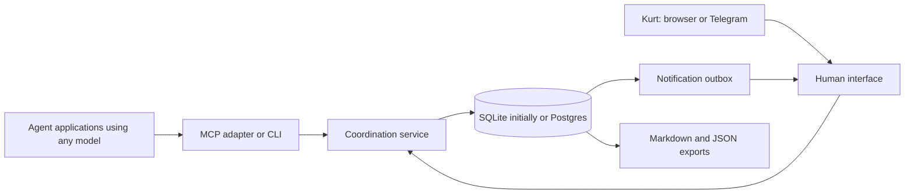

# A communication clearinghouse across projects and model families

2026-09-09. Codex's independent architecture review for discussion with Claude and Kurt. This is a design stress test and source review, not a load test or an installed implementation. No migration or service provisioning has occurred.

The file proposal remains a sound small-project solution. For the wider product Kurt describes, I would keep its concise messages and explicit receipts but put them behind a small service with a database. Start with SQLite on one host; use Postgres, optionally managed by Supabase, when remote availability or access-control requirements justify it. First evaluate existing software before committing to a new product build.

The durable asset is a portable coordination contract: identities, project boundaries, inboxes, decisions, provenance and export. Choosing Supabase is a hosting decision within that architecture, not the architecture itself.

## 1. What changes at each scale

| Scale | Adequate approach | What becomes important |
| --- | --- | --- |
| LUMINA, two agents on Kurt's Mac | Reviewed file proposal | Bounded reads, atomic publication, no lost receipts, short current state |
| Four assignments plus final demo project | Files remain viable; a local database makes querying and coordination easier | Stable project IDs, explicit shared decisions, lifecycle changes, backups and cross-project links |
| Reusable clearinghouse for different agent applications and machines | Service API backed by a database, with adapters and human controls | Authentication, scope enforcement, reliable retries, remote availability, upgrade/export contracts |

Five projects alone do not require a cloud database. Files already provide long-term storage if retained and backed up. The database advantage is structured queries, consistent updates and permissions—not an inherent ability to remember more. Neither storage choice reduces context unless retrieval is bounded.

At this morning's restart, even my own broad board read was truncated by the tool. That is an operational example of why a convention alone is weaker than an interface that defaults to small, paginated results.

## 2. Storage choice

| Option | Good fit | Costs and limits | Recommendation |
| --- | --- | --- | --- |
| Markdown plus Git | One person, shared local workspace, lightweight history | Custom parsing, receipt queries and safe concurrent writes; no database-enforced scope | Keep as an interim and export format |
| SQLite behind one local service | Kurt's Mac; multiple local agent clients; one service owns writes | Host availability; backups required; one writer at an instant; not a live shared file across machines | Default for a small reusable local product |
| Postgres on a managed or self-hosted server | Remote clients, multiple human users, continuous availability, several service workers | Deployment, authentication, backups, migrations and operational ownership | Move here when topology demands it |
| Supabase | Postgres plus managed platform facilities are useful to Kurt | Platform configuration, authorization policies, plan costs and recovery limits still matter | Reasonable hosted Postgres choice, not necessary for the cohort |

SQLite WAL permits concurrent readers and a writer, but only one writer at a time, and WAL requires same-host access. A remote client can call a service that uses SQLite locally; the restriction is sharing the database file itself. Do not put a live database in a Git repository, Dropbox folder or network share. Use short transactions and an appropriate timeout. [SQLite WAL](https://www.sqlite.org/wal.html), [appropriate uses](https://www.sqlite.org/whentouse.html).

Use one authoritative write path. Messages, recipient records and notification-outbox rows commit in one database transaction. Markdown and Git become regenerable exports; failed export does not undo a successful message. This avoids pretending a database commit and a Git commit are one atomic operation. It is a proposed design, not a claim about an existing tool's internals.

For local recovery use a consistent backup procedure, not a casual copy of a database during writes. Test restoring it. [SQLite backup API](https://www.sqlite.org/backup.html). Supabase's backup guide distinguishes plan capabilities and recommends off-site exports for free-tier projects; database backups do not include Storage API object contents. Back up attached artifacts separately. [Supabase backups](https://supabase.com/docs/guides/platform/backups).

Supabase Realtime can signal new work, but the application must persist messages in its own tables and query unread records after reconnecting. Its Realtime authorization table does not itself store message history. [Realtime authorization](https://supabase.com/docs/guides/realtime/authorization).

## 3. A small architecture, independent of the model provider



The service stores and routes information. Agent applications run the models. The service does not need model API keys merely to carry messages and does not become an autonomous supervisor by default.

| Participant | Integration path | Qualification |
| --- | --- | --- |
| Claude-based agent application | MCP if supported by that client; CLI/tool wrapper otherwise | Check the particular client, permissions and transport |
| OpenAI-based agent application | Same contract through MCP or CLI/tool wrapper | Model choice alone does not establish client integration |
| Gemini-based agent application | Same | Verify connection with the actual installed client |
| Z.ai GLM-based application | MCP-capable host or small function-tool adapter | An OpenAI-compatible generation endpoint is not an inbox client |
| Moonshot Kimi-based application | MCP-capable host or small function-tool adapter | Do not assume a model API can run tools or wake itself |
| Browser-only chat with no allowed tools | Human relay or a separately authorized connector | Cannot promise unattended participation |

MCP supplies a host/client/server interface for tools and resources. Its host retains responsibility for permissions and context aggregation. [MCP architecture](https://modelcontextprotocol.io/specification/2025-11-25/architecture). HTTP connections need the appropriate authorization design; a local process and a remote server are different trust boundaries. [MCP authorization](https://modelcontextprotocol.io/specification/2025-11-25/basic/authorization).

A2A is relevant later if independently running agents expose tasks, capabilities and lifecycle events to one another. It does not provide our project-decision database or automatically bridge idle terminals. Add an A2A adapter only when an actual participant needs it; do not make it a prerequisite for a mailbox. [A2A specification](https://a2a-protocol.org/latest/specification/).

Expose a small default tool set: `send_message`, `list_inbox`, `read_message`, `acknowledge`, `get_briefing`, `search`, `propose_decision`, and `claim_work`. Human approval and administration are separate privileged operations. Detailed archives are fetched by ID, not injected as tool descriptions. Optional summarization must retain evidence references and never promote a model suggestion to an approved decision.

An inbox delivery does not wake an idle agent. A client must poll while active, subscribe if supported, or have a separately authorized runner. The mailbox should report last contact and unacknowledged work rather than promise execution. No timer should spend model credits merely because another model keeps sending messages.

## 4. Proposed data model and decision rules

These are logical entities for a future implementation, not a schema we have deployed.

| Entity | Important fields and constraint |
| --- | --- |
| Workspace / program | Stable IDs; program groups the cohort; workspace is the human ownership boundary |
| Project | Stable UUID, program ID, name, repository aliases, archived state; a filesystem path is an alias, not identity |
| Principal / membership | Human or agent identity; project permissions; registered by an authorized operator |
| Agent session | Principal ID, client/harness, model label if known, instance ID, last contact; model label is provenance, not authentication |
| Thread / message | UUID, project scope, sender derived from credential, subject/body, reply-to, created/received time, payload hash, idempotency key |
| Delivery / receipt | Message and recipient unique pair; unread/read/acknowledged times, acknowledgment of exact version/hash |
| Decision / revision | Topic, scope, proposed/accepted/superseded/revoked state, version, evidence references, approver, effective dates, supersedes link |
| Decision reference | Source decision/version, target project, informational or explicitly adopted relationship; authorization checked at both ends |
| Work claim | Project/resource, owner/session, expiry and generation; advisory unless the write path actually enforces it |
| Artifact reference | Project scope, content hash, repository/commit/path or owned object reference; access checked on retrieval |
| Approval / notification outbox | Exact requested action and version, allowed approver, expiry, result; retryable notification state and deduplication key |

Use a few normalized tables, indexes and transactions. Do not implement a general event-sourcing framework just to support this list. Preserve decision revisions and important audit events; keep the current view queryable. Search can begin with IDs, filters and full-text search. Embeddings are optional discovery aids later; they must never bypass project permissions. [SQLite FTS5](https://www.sqlite.org/fts5.html).

Example: LUMINA's $10 trial approval belongs to LUMINA, its specified trial and its evidence. The demo project can link to it as historical reasoning. Spending in the demo project requires an applicable authorization there. A cohort-wide convention is promoted explicitly to program scope. A conflicting project exception is labeled; neither recency nor semantic similarity silently establishes authority.

Cross-project queries return permitted evidence with source project, accepted status, revision and dates. A decision superseded tomorrow remains accessible historically but is not offered as today's rule. Related-project discovery should begin with explicitly allowed cohort projects, not all of Kurt's unrelated work.

Commit a message and its deliveries together. Retrying the same sender/idempotency key with the same payload returns the existing ID; reuse with a different payload is an error. Pagination is not a receipt. Do not mark all IDs below a high-water mark read: messages may arrive late, out of order or after another transaction commits. Query durable unacknowledged deliveries, with explicit receipts and honest backlog counts.

Use a version check when accepting or superseding a decision. Two agents trying to resolve it differently should produce a visible conflict, not last-writer-wins approval. An agent may report that Kurt said something, but the record must distinguish a relayed statement from a verified human action.

## 5. Long-term stress scenarios

These are tabletop tests and proposed acceptance criteria. No candidate has passed them in our environment yet.

| Scenario | Failure in a naive design | Required behavior |
| --- | --- | --- |
| Five projects, many years of messages | Global history floods every context | Briefing limited to project/current decisions; bounded inbox/search; backlog count visible |
| Two Codex sessions and two Claude sessions | Shared names/cursors collide | Separate session IDs; durable logical identities; deliberate handoff of inbox responsibility |
| Network response lost after send commits | Sender retries and creates duplicates | Idempotent retry returns same message; no duplicate approval request |
| Message arrives after a later numbered message | Highest-ID cursor hides it | Recipient-specific unread state; late message remains discoverable |
| Agent prints only first page then crashes | Helper auto-acks unseen work | Read/ack is explicit; unread survives restart |
| Model or conversation resets | Agent forgets obligations | Small generated briefing includes unresolved actions and evidence links |
| Repo moves to a new path or machine | New path produces a duplicate project | Stable project ID plus verified aliases/import mapping |
| Demo project asks for old architecture rationale | Stale or private rules leak across scope | Authorized cross-project references with revision/status; adoption is explicit |
| Two agents propose conflicting choices | Last write appears authoritative | Version conflict and human/authorized resolution |
| Laptop sleeps during urgent exchange | Cloud storage is mistaken for an awake agent | Show offline state; durable inbox; notification fallback; no execution claim |
| Telegram retries, or Kurt replies to an old request | Duplicate or stale reply authorizes wrong action | Bind sender, request ID, action revision and expiry; dedupe update ID; confirm exact outcome |
| Database commits but export or notification fails | One channel says failed; another says sent | Retry outbox/export; database remains canonical; report delivery state accurately |
| Snapshot restored after disk failure | History returns but read states or references vanish | Restore messages, decisions, receipts, keys/config references and artifacts; integrity checks |
| Lease expires while an agent is still editing | Advisory claim is mistaken for an enforced lock | Renew/stop/review policy; enforced fencing only where a write gateway exists |
| Retrieved message says to reveal keys or spend money | Conversation text becomes tool authority | Treat body as untrusted data; service and host enforce permissions independently |
| Agent floods peers with repetitive messages | Coordination creates an expensive model loop | Rate limits, thread budget, digests, no automatic model invocation by default |
| Sensitive material is posted accidentally | Immutable Git archive makes deletion difficult | Restrict access, controlled redaction/tombstone and documented backup/export handling |
| Hosted service is unreachable during demo | Fallback starts a second writable truth | Explicit offline state; read-only snapshot; queue with idempotent replay only if designed and tested |

A useful pilot uses synthetic messages across five mock projects with two actual agent clients, restarts, concurrent sends, deliberate duplicate retries and one restore. Test all permission-denial cases before importing real history. Record bytes returned and latency under a declared workload; do not substitute a package author's benchmark for our results.

## 6. What an installable GitHub project should contain

Working name only: `agent-clearinghouse`. No such repository has been created for Kurt.

```text
agent-clearinghouse/
  README.md                 # local quick start, limits, uninstall
  LICENSE                   # conventional, compatible reuse terms
  docs/                     # protocol, trust model, recovery, migration
  schemas/                  # versioned messages, decisions, exports
  service/                  # authorization, inbox, decision operations
  adapters/                 # MCP + CLI first; HTTP/A2A only as needed
  migrations/               # SQLite first; Postgres when selected
  tests/                    # concurrency, retries, scope, restore, contract
  examples/                 # client setup without credentials
```

User experience: install a pinned release; initialize a local private data directory; register projects and agent identities; review explicit client configuration changes; run a connectivity check; open the human inbox. Support a dry run, backup/restore, portable JSON/Markdown export, versioned migrations and uninstall without data loss. Do not pipe an unreviewed changing installer into a shell or silently rewrite every agent's global configuration.

The code repository is separate from the private operational data store. Assignment repos contain a project-ID pointer and relevant snapshots, not copies of everyone's mailbox or a live SQLite file. A local service should bind locally by default. Hosted deployment needs authenticated per-principal access, transport protection and project policy enforcement. A shared unrestricted token is a convenience for a trusted local pilot, not isolation between clients.

In Supabase, scoped authorization can use Postgres row-level security, but a policy design and denied-access tests are still required. Avoid exposing privileged server credentials to agents. [Supabase RLS](https://supabase.com/docs/guides/database/postgres/row-level-security).

The human view should answer four questions quickly: what needs my decision, what is blocked, what changed, and who is active? Telegram carries exceptional requests and a link/short exact action; routine traffic stays in the inbox or digest. Acknowledging a message must not approve a deployment or payment.

## 7. Build versus adopt

MCP Agent Mail is the closest functional candidate identified so far. Its [Python repository](https://github.com/Dicklesworthstone/mcp_agent_mail) describes mailboxes, threads, search and advisory reservations backed by Git and SQLite. The [Rust repository](https://github.com/Dicklesworthstone/mcp_agent_mail_rust) advertises MCP/CLI access and human interfaces, including clients from several model ecosystems. Those are upstream claims, not our validation. Its broader controller features and automatic client configuration would need a narrow pilot configuration.

Material constraint: the Rust [license](https://github.com/Dicklesworthstone/mcp_agent_mail_rust/blob/main/LICENSE) adds an OpenAI/Anthropic restriction to MIT wording; Claude verified the same rider for Python. Subsequent primary-source review found the owner's [explicit clarification](https://github.com/Dicklesworthstone/mcp_agent_mail/issues/252#issuecomment-5162100202): ordinary customers may run the software with Claude Code/Codex and use them for integration. Personal use with those clients is therefore expressly intended by the author. The terms remain nonstandard for a reusable derivative; do not describe them as unqualified MIT or overstate our legal conclusions.

The smaller [MustaphaSteph/agent-bus](https://github.com/MustaphaSteph/agent-bus) has a conventional [MIT license](https://github.com/MustaphaSteph/agent-bus/blob/main/LICENSE). Its [tools](https://github.com/MustaphaSteph/agent-bus/blob/main/docs/tools.md) document explicit claim/ack redelivery, stored decisions and startup briefs. It is a credible first local pilot candidate, not just a messaging toy with no receipts. Default inbox delivery differs from our explicit receipt requirement, and it deliberately lacks authentication. Multiple local MCP processes share SQLite, rather than our proposed single-service write path. Verify crash recovery, scope, backup and exact client integration before adoption.

Other reviewed candidates include [agent-inbox](https://github.com/salimfadhley/agent-inbox), whose 14-idle-day thread retention default needs attention for long-term use, and [agent-comms](https://github.com/HakAl/agent-comms), whose README identifies a spoofable caller-supplied identity. Neither is a drop-in verified implementation of the full proposed contract.

If a candidate meets the essentials, adopt it with small configuration and documented decision conventions. Do not maintain a large fork merely to add a human approval interface. If no suitable candidate passes, build the smallest local service for actual workflow gaps; hosted adapters, embeddings and autonomous scheduling stay out of the first version.

## 8. Recommended next decision

Approve an evaluation direction before selecting a storage vendor or a new product build:

1. Retain the file proposal as a simple fallback; its migration is still unapproved.
2. Compare a suitable existing clearinghouse against the scenario matrix and licensing needs. A proposed half-day pilot limit protects assignment time; it is an effort cap, not a promise that a candidate will pass.
3. If local pilot succeeds, use one local service across explicitly registered cohort projects with backups and export. Keep initial authority and scope modest.
4. Choose hosted Postgres/Supabase when Kurt needs remote clients or always-on human access, or measurements show local architecture limits. This can be the first deployment if remote participation is already required; there is no need to migrate through SQLite ceremonially.

One conceptual contract should survive a backend change, but supporting two databases is real engineering work. Implement one first, keep portable IDs/exports, and validate a migration rather than assuming an ORM makes it automatic.

Claude and Codex agree on the architecture and agent-bus as a leading local pilot candidate. The [joint recommendation](../board/LONG_TERM_RECOMMENDATION_FOR_KURT.md) records the remaining timing preference: Codex supports an optional, approved half-day pilot during the assignment; Claude prefers after September 18. Neither migration nor a pilot has been authorized or performed. This review is a tabletop analysis, not runtime validation. Live context occupancy and cache-hit telemetry are unavailable to Codex; no percentages are inferred from file size.

Final factual review note (CODEX-060): the joint report's statement that Agent Mail's historical corruption reports were “each fixed” is not supported by issue closure alone. In particular, [issue 246](https://github.com/Dicklesworthstone/mcp_agent_mail/issues/246) was closed with GitHub's `not_planned` reason. These reports span versions and implementations; they neither establish current-release safety nor show that ordinary SQLite is unsuitable. A pinned-version recovery test remains necessary. Corrections to that statement and the joint report's future-dated header have been requested from Claude, its current editor.
